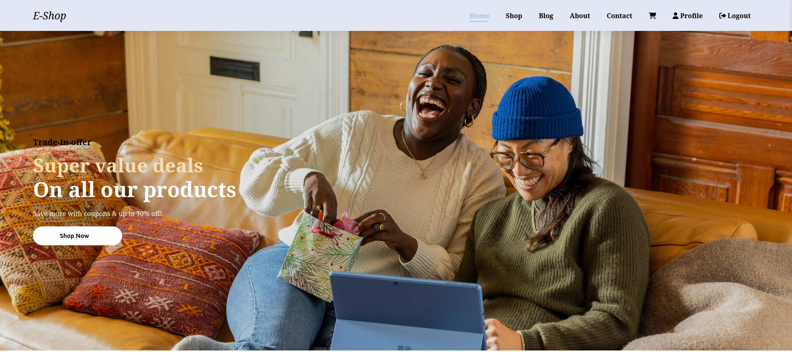

# E-commerce Flask Application

An e-commerce web application built with Flask, designed to allow users to browse and purchase products. The app includes features for managing user profiles, product categories, carts, favorites, and admin functionalities like product management and uploading images.

## Project Links

- **Deployed Site**: [E-commerce Web Application](https://www.developmentenv.tech/home).
- **GitHub Repository**: [Project GitHub](https://github.com/vergilx6x/E-commerce-v2.git).
- **Landing Page**: [Landing Page](https://vergilx6x.github.io/E-commerce-v2/).
- **Author LinkedIn**: [Mohamed Amine Thami](https://www.linkedin.com/in/mohamed-amine-thami-526b9b280/).

## Introduction

This application offers a fully functional e-commerce platform where users can:

- Browse products across different categories.
- Add items to their shopping cart.
- Mark products as favorites for easy access later.
- Manage their profiles with options to upload profile pictures.
- Admin users can manage products, categories, and users and upload product images.

## Features
- **User Authentication**: Register, log in, and manage user profiles.
- **Product Management**: Admins can add, edit, delete products, and upload product images.
- **Cart Management**: Users can manage their shopping cart by adding and removing products.
- **Favorites**: Add products to a favorites list for future reference.
- **Category Browsing**: Products are categorized for easier browsing.
- **Admin Panel**: Manage products, categories, users, and images.
- **Responsive Design**: Built with Bootstrap 5, ensuring a responsive and modern user interface.

## Project Structure

```bash
.
├── api
│   ├── app
│   │   ├── blueprints
│   │   │   ├── auth
│   │   │   │   ├── __init__.py
│   │   │   │   └── routes.py
│   │   │   ├── carts
│   │   │   │   ├── __init__.py
│   │   │   │   └── routes.py
│   │   │   ├── categories
│   │   │   │   ├── __init__.py
│   │   │   │   └── routes.py
│   │   │   ├── index.py
│   │   │   ├── __init__.py
│   │   │   ├── orders
│   │   │   │   ├── __init__.py
│   │   │   │   └── routes.py
│   │   │   ├── products
│   │   │   │   ├── __init__.py
│   │   │   │   └── routes.py
│   │   │   └── users
│   │   │       ├── __init__.py
│   │   │       └── routes.py
│   │   ├── config.py
│   │   ├── engine
│   │   │   ├── db_engine.py
│   │   │   └── __init__.py
│   │   ├── __init__.py
│   │   └── models
│   │       ├── base_model.py
│   │       ├── cart_item.py
│   │       ├── cart.py
│   │       ├── category.py
│   │       ├── favorite.py
│   │       ├── __init__.py
│   │       ├── order_item.py
│   │       ├── order.py
│   │       ├── product.py
│   │       └── user.py
│   ├── README.md
│   └── run.py
├── env_bash.sh
├── env_test_bash.sh
├── README.md
├── requirements.txt
├── setup_db.sh
└── web_app
    ├── app
    │   ├── blueprints
    │   │   ├── auth
    │   │   │   ├── __init__.py
    │   │   │   └── routes.py
    │   │   ├── carts
    │   │   │   ├── __init__.py
    │   │   │   └── routes.py
    │   │   ├── categories
    │   │   │   ├── __init__.py
    │   │   │   └── routes.py
    │   │   ├── home
    │   │   │   ├── __init__.py
    │   │   │   └── routes.py
    │   │   ├── __init__.py
    │   │   ├── products
    │   │   │   ├── __init__.py
    │   │   │   └── routes.py
    │   │   └── users
    │   │       ├── __init__.py
    │   │       └── routes.py
    │   ├── __init__.py
    │   ├── static
    │   └── templates
    │       ├── about.html
    │       ├── base.html
    │       ├── cart.html
    │       ├── category.html
    │       ├── contact.html
    │       ├── index.html
    │       ├── login.html
    │       ├── product_detail.html
    │       ├── register.html
    │       ├── shop.html
    │       └── user_profile.html
    ├── config.py
    ├── README.md
    └── run.py

23 directories, 64 files

```

## Installation

- 1- Clone the repository:
```bash
git clone https://github.com/vergilx6x/E-commerce-website.git
cd E-commerce-website
```

- 2- Install Python 3 (if not already installed):
  - [Python Installation Guide](https://www.python.org/downloads/).

- 3- Set up a virtual environment:
```bash
python3 -m venv venv
source venv/bin/activate
```

- 4- Install required packages:
```bash
pip install -r requirements.txt
```
- 5- Install MySQL (if not installed):
  - Follow instructions for your operating system on the [MySQL installation page](https://dev.mysql.com/doc/mysql-installation-excerpt/5.7/en/).

- 6- Set up the database:
  - Modify your database credentials in the config file (ensure your MySQL server is running).
```bash
bash setup_db.sh
```
- 7- Export env variables:
```bash
source env_bash.sh
```

- 8- Run the Flask API application:
```bash
python3 -m api.run
```

- 9- Run the Flask Web application:
```bash
python3 -m web_app.run
```

- 10- Access the app:
  - Visit: http://localhost:5002
  
## Usage

- **User Registration**: Sign up for an account to browse products, manage your shopping cart, and save favorite products.
- **Admin Features**: Log in as an admin to access the admin panel for managing products, categories, and users.
- **Cart Management**: Users can add products to the cart, update quantities, or remove items.
- **Favorites**: Easily mark and manage favorite products.

## Contributing
- 1- Fork the repository.
- 2- Create your feature branch: git checkout -b feature/AmazingFeature
- 3- Commit your changes: git commit -m 'Add some AmazingFeature'
- 4- Push to the branch: git push origin feature/AmazingFeature
- 5- Open a pull request.

## Related Projects
- Flask-Admin - Admin interface for Flask apps.
- Flask-Login - User session management for Flask.

## Licensing

This project is licensed under the MIT License - see the LICENSE file for details.

## Screenshots:



## About

This project aims to create a platform where users can find high-quality gadgets and special items designed to enhance productivity and lifestyle. Emphasizing quality over quantity, the platform will feature carefully selected products that genuinely add value, avoiding unnecessary or low-quality options. Developed independently with plans to expand the team, the project utilizes Python with Flask, MySQL, and SQLAlchemy for the backend, and HTML, CSS, JavaScript, and Bootstrap for the frontend. Key features include secure user accounts, a shopping cart, favorites, and order tracking. Key challenges included designing effective database models and handling diverse user scenarios, which highlighted the importance of thorough planning and early implementation of unit tests. The project is inspired by the need for reliable tools that improve everyday life, addressing gaps in both local and online markets.
